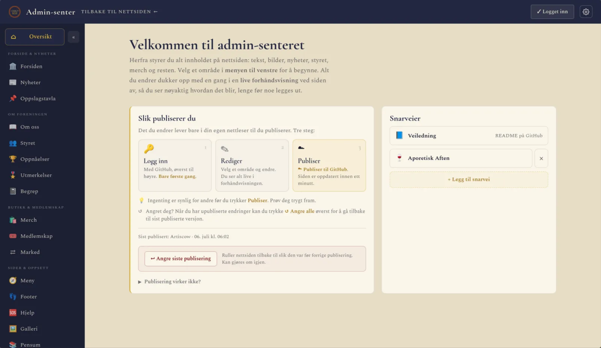
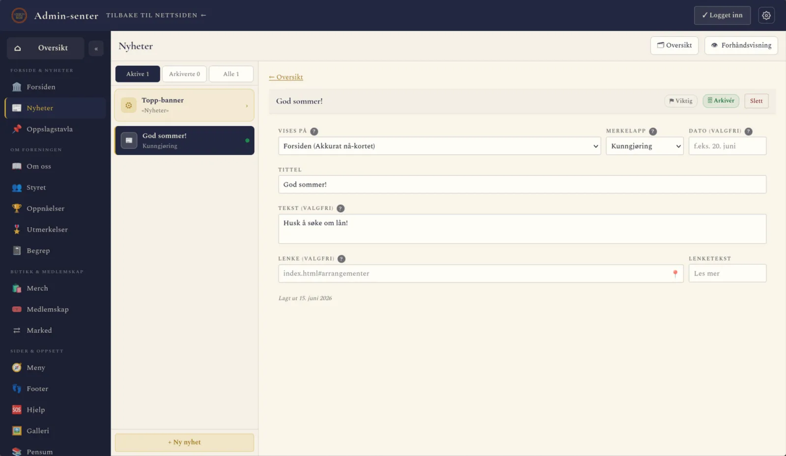
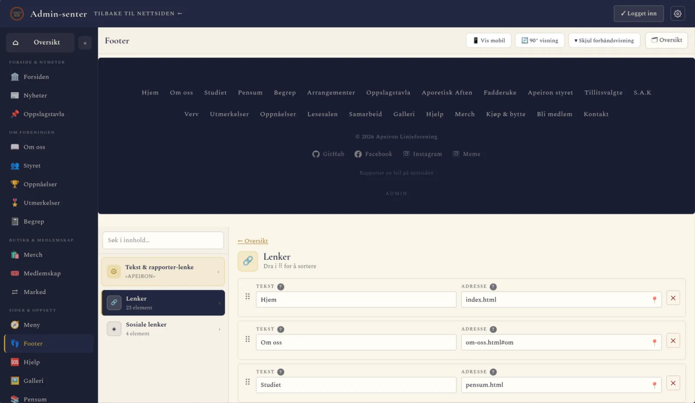
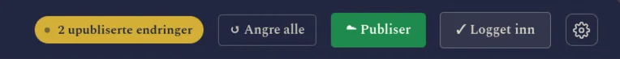
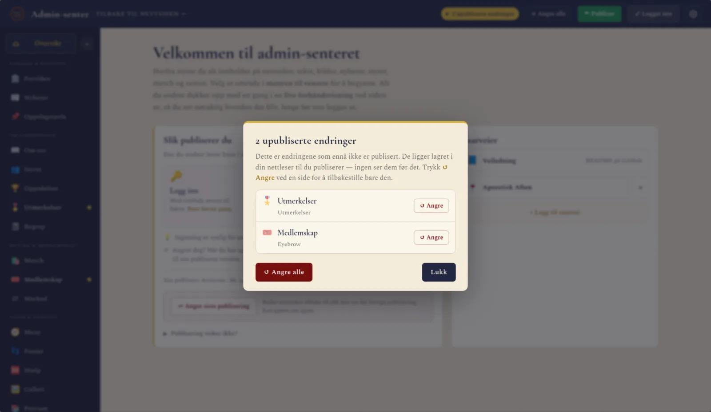

# 🖊️ Brukerveiledning: endre innhold på Apeiron-nettsiden

Denne veiledningen er for deg som skal **oppdatere innholdet** på nettsiden — nyheter,
styret, merch, bilder og alt annet besøkende ser. Du trenger ingen programmer, og du
skal **aldri åpne eller endre en kodefil**. Alt gjøres i nettleseren.

**Hva vil du gjøre?**

| Jeg vil … | Slik gjør du det |
| --- | --- |
| Endre tekst, nyheter, styret, merch, bilder på sidene … | [Admin-senteret](#1-åpne-admin-senteret) |
| Legge inn eller endre et arrangement | [Google Kalender](#arrangementer-og-fadderuke-google-kalender) |
| Legge ut bilder fra et arrangement | [Google Drive](#galleri-google-drive) |
| Noe gikk galt, eller jeg ser ikke endringen min | [Feilsøking](#6-feilsøking-vanlige-spørsmål) |
| Drifte selve koden | [VEDLIKEHOLD.md](VEDLIKEHOLD.md) |

> 🧑‍🔧 **Den ene regelen:** Hvis du ikke vedlikeholder selve koden, skal du aldri gå
> inn i en fil på GitHub og redigere teksten i den. All redigering skjer i
> Admin-senteret.
>
> Drifter du koden? Da er teknisk dokumentasjon samlet i
> **[VEDLIKEHOLD.md](VEDLIKEHOLD.md)** (publisering, oppsett, filstruktur, Apps Script osv.).

**Innhold**
1. [Åpne Admin-senteret](#1-åpne-admin-senteret)
2. [Slik redigerer du](#2-slik-redigerer-du)
3. [Slik publiserer du](#3-slik-publiserer-du-gjør-endringene-synlige-for-alle)
4. [Hva styrer hva](#4-hva-styrer-hva)
5. [Deler som styres utenfor Admin-senteret](#5-deler-som-styres-utenfor-admin-senteret) — arrangementer, fadderuke, galleri
6. [Feilsøking: vanlige spørsmål](#6-feilsøking-vanlige-spørsmål)
7. [Trenger du noe mer avansert?](#7-trenger-du-noe-mer-avansert)

---

## 1. Åpne Admin-senteret

Bla ned til bunnen av siden og trykk på "Admin", eller legg til `/admin.html` på slutten av nettadressen:

```
https://apeironlf.pages.dev/admin.html
```

Du møter en meny med alle delene av siden du kan endre. Selve redigeringen og
forhåndsvisningen krever **ingen innlogging**, du logger bare inn med GitHub når du
vil **publisere** (knappen øverst til høyre).



---

## 2. Slik redigerer du

1. **Velg en del** i menyen (Nyheter, Forsiden, Styret, Merch …).
2. **Rediger feltene.** En **live forhåndsvisning** ved siden viser hvordan det blir.
3. Det du skriver lever i **din egen nettleser** mens du jobber og vises i
   forhåndsvisningen, men det er **ikke publisert** ennå. Lukker du admin uten å
   publisere, starter den fra den publiserte versjonen neste gang, så **publiser før du
   forlater** (admin minner deg på det hvis du har upubliserte endringer).

De fleste paneler lar deg legge til, slette og **dra for å endre rekkefølge** på kort
(medlemmer, produkter, nyheter osv.), og laste opp bilder ved å klikke på bildefeltet
eller dra et bilde inn.

> 💡 **Du trenger ikke å forminske bilder selv.** Når du laster opp et bilde, krymper
> admin det automatisk til en passende størrelse (du kan trygt laste opp rett fra
> telefonen). Store bilder blir mindre uten at du merker noe, så sidene laster raskt.



Knappen **Forhåndsvisning** øverst til høyre viser siden slik den blir. I noen paneler
(f.eks. Footer og Meny) ligger forhåndsvisningen fast over skjemaet mens du redigerer:



> 💡 **Angret på noe?** **Ctrl/Cmd+Z** angrer slettinger og tillegg mens du jobber.

> ⚙ **Tilpass admin til deg:** tannhjulet øverst til høyre åpner **Innstillinger**, der du
> velger navigasjon (sidemeny eller faner) og panelvisning (**Liste + detalj** eller
> **Klassisk** med alle kort under hverandre). Valgene lagres bare i din nettleser og
> endrer ingenting på selve nettsiden.

---

## 3. Slik publiserer du (gjør endringene synlige for alle)

Med GitHub-innlogging publiserer du **rett fra Admin-senteret**, uten filer å laste ned
eller pushe manuelt.

1. **Logg inn** med GitHub-kontoen din via **Logg inn**-knappen øverst til høyre. (Bare
   første gang; du holder deg innlogget i **30 dager**.)
2. **Rediger** i panelene som vanlig. Så snart noe er endret, viser topplinja hvor mange
   sider som har upubliserte endringer, sammen med knappene **↺ Angre alle** og **☁ Publiser**:

   

3. Trykk **☁ Publiser**. Endringene skrives rett til nettsidens repo (én samlet «commit»).
4. Vent ca. ett minutt. Nettsiden oppdaterer seg selv automatisk.

På **Oversikt**-siden står de tre stegene oppsummert, sammen med «Sist publisert» og
angre-knappen (se bildet under [Åpne Admin-senteret](#1-åpne-admin-senteret)).

> 💡 **Hva har jeg egentlig endret?** Klikk på **«… upubliserte endringer»** i topplinja for
> en oversikt over hvilke sider som er endret. Der kan du angre én side om gangen, eller
> alt på én gang:
>
> 

> 💡 **Hvem kan publisere?** Bare GitHub-kontoer som er satt opp med tilgang (se
> [docs/github-publisering-oppsett.md](docs/github-publisering-oppsett.md)). Hver publisering merkes med hvem som gjorde den,
> og toppen viser **«Sist publisert: navn · tidspunkt»**.

> 👥 **Jobber dere flere samtidig?** Har noen andre publisert de samme sidene etter at du
> åpnet admin, varsler admin deg **før** du publiserer, så du ikke uforvarende overskriver
> arbeidet deres. Velg da **«↻ Last inn på nytt»** for å hente deres versjon først.

> 🛟 **Reserveløsning:** skulle publisering svikte, finnes en backup som laster ned filene
> for manuell opplasting til GitHub. Den trenger du normalt ikke. Full framgangsmåte for
> drift står i [VEDLIKEHOLD.md](VEDLIKEHOLD.md).

---

## 4. Hva styrer hva

Hver del i menyen styrer én del av nettsiden:

| Panel | Styrer |
| --- | --- |
| **Forsiden** | Toppbildet, «Om oss»-teksten, FAQ og kontaktinfo på forsiden |
| **Om oss** | Innholdet på Om oss-siden: seksjoner, lys/mørk tone per seksjon, og minimenyen «På denne siden» i toppbanneret |
| **Nyheter** | Kunngjøringer og beskjeder (på forsiden + arkiv på Nyheter-siden) |
| **Oppslagstavla** | Plakatene på oppslagstavla og forside-teaseren |
| **Styret** | Styremedlemmer, portretter og beskrivelse av vervene |
| **Merch** | Produktene i nettbutikken |
| **Begrep** | Begrep-tidsskriftet: utgaver, podkast, film, julekalender |
| **Medlemskap** | Priser, Vipps-nummer og innmeldingssteg |
| **Pensum** | Emner gruppert per studieretning (Felles · Filosofi · Etikk · Master), inkl. seksjoner og farger |
| **Hjelp** | Hjelp & ressurser-siden |
| **Meny** | Lenkene i hovedmenyen (topp + mobil). Et underpunkt kan òg være en **gruppeoverskrift** («+ Overskrift») for å dele opp en lang nedtrekksmeny |
| **Footer** | Bunnteksten og de sosiale lenkene |
| **Oppnåelser** | Milepæler / oppnåelser |
| **Utmerkelser** | Utmerkelser og priser |

Publiser alt på én gang med **☁ Publiser** øverst til høyre.

> 💡 **Hastebeskjed?** En kjapp viktig melding (for eksempel «Aporetisk i kveld er flyttet»)
> legger du ut i **Nyheter**-panelet. Skru på **⚑ Viktig** og velg hvor den skal vises.
> Den dukker opp i «Akkurat nå»-kortet på forsiden.

> 💡 **Hvor mange arrangement i «Akkurat nå»-kortet?** I **Forsiden → Hero** velger du om
> kortet skal vise kun neste arrangement, de neste to eller de neste tre. Arrangementene
> hentes automatisk fra kalenderne — du trenger ikke legge dem inn manuelt.

---

## 5. Deler som styres utenfor Admin-senteret

Noen ting er enda enklere, og de oppdateres helt uten kode, men i et annet verktøy enn
Admin-senteret:

### Arrangementer og fadderuke: Google Kalender

Legg til, endre eller slett arrangementer direkte i **Google Kalenderne** til Apeiron.
Nettsiden henter dem automatisk og oppdaterer seg selv.

- Skriv kategorien først i tittelen, med kolon, for å tagge: `Fagkveld: Etikk & KI`
- Sted hentes fra «Sted»-feltet i kalenderhendelsen
- Aktivitetskalenderen er for alt som ikke hører til Aporetisk Aften eller Fadderukene
  (de har egne kalendere)

**Fadderuke:** samme prinsipp — legg postene i **fadderuke-kalenderen**. Skriv type med
kolon: `Grill: Bli-kjent-kveld`

### Galleri: Google Drive

**Du trenger aldri å røre koden for å oppdatere galleriet.** Alt styres fra én delt
Google Drive-mappe. Nettsiden leser den hver gang noen åpner galleri-siden, så
endringer du gjør i Drive dukker opp på nettsiden av seg selv.

#### Hvordan mappene må ligge

Det viktigste å forstå: mappene må ligge i **nøyaktig tre nivåer nedover**, som esker
inni esker. Hopper du over et nivå, vises ikke bildene.

```
📁 ALT SOM LASTES OPP HER ...        ← NIVÅ 1: hovedmappen (legg aldri bilder rett her)
   │
   ├── 📁 2025/2026                  ← NIVÅ 2: ett skoleår. Blir en fane øverst i galleriet.
   │      │
   │      ├── 📁 Halloweenfest       ← NIVÅ 3: ett arrangement. Blir ett bildekort.
   │      │      ├── 🖼️ bilde1.jpg    ← bildene selv ligger HER, helt innerst
   │      │      ├── 🖼️ bilde2.jpg
   │      │      └── 🖼️ bilde3.jpg
   │      │
   │      └── 📁 Sommerfest
   │             └── 🖼️ ...
   │
   └── 📁 2024/2025
          └── 📁 Fadderukefest
                 └── 🖼️ ...
```

1. **Hovedmappen** er den styret har delt. Inni den lager du bare skoleår-mapper.
2. **Skoleår-mappene** (nivå 2) lager du inni hovedmappen. Navnet, f.eks. `2025/2026`,
   blir teksten på fanen øverst i galleriet. Bruk alltid samme navneform.
3. **Arrangement-mappene** (nivå 3) lager du inni en skoleår-mappe. Navnet blir
   tittelen på bildekortet. Kall den noe gjenkjennelig, f.eks. `Fadderukefest`.
4. **Bildene** legger du helt innerst, rett inni arrangement-mappen.

#### Tre ting som er lett å gjøre feil

- **Bilder må ligge inni en arrangement-mappe.** Løse bilder i en skoleår-mappe (eller i
  hovedmappen) blir hoppet over.
- **Forsidebildet på kortet blir det bildet som kommer først alfabetisk** på filnavn.
  Vil du styre det, gi det et navn som havner først, f.eks. `01.jpg` eller `aaa-forside.jpg`.
- **Nyeste skoleår vises først** av seg selv: `2025/2026` legger seg foran `2024/2025`.

#### Legg til bilder fra et nytt arrangement

1. Åpne den delte hovedmappen i Google Drive (spør styret om lenken).
2. Finn mappen for inneværende skoleår, f.eks. `2025/2026`. Finnes den ikke, lag den.
3. Gå **inn i** skoleår-mappen og lag en ny mappe med navnet på arrangementet.
4. Gå **inn i** arrangement-mappen og last opp bildene dit.
5. Ferdig. Neste gang noen åpner galleriet er bildene der.

> **Viktig om deling:** Hovedmappen og alt inni den må være delt som «Alle med lenken
> kan se». Er en mappe privat, klarer ikke nettsiden å hente bildene. Spør styret hvis
> du er usikker.

---

## 6. Feilsøking: vanlige spørsmål

**«Jeg publiserte, men ser ingen endring på nettsiden.»**
Publiseringen tar ca. ett minutt før den er live. Vent litt og last siden på nytt.
Ser du fortsatt det gamle, prøv en hard oppdatering (**Ctrl+F5**, på Mac **Cmd+Shift+R**).

**«Jeg får ikke logget inn / publisert.»**
Bare GitHub-kontoer som er gitt tilgang kan publisere. Spør den som drifter siden om å
legge deg til (oppskriften ligger i [docs/github-publisering-oppsett.md](docs/github-publisering-oppsett.md)).

**«Admin varsler at noen andre har publisert.»**
Noen publiserte de samme sidene etter at du åpnet admin. Velg **«↻ Last inn på nytt»**
for å hente deres versjon først, og gjør endringene dine på nytt — ellers risikerer du å
overskrive arbeidet deres.

**«Jeg publiserte noe feil.»**
På **Oversikt**, under «Slik publiserer du», ligger **↩ Angre siste publisering**
(synlig når du er innlogget). Den ruller hele nettsiden tilbake til slik den var før
siste publisering — og kan angres på nytt hvis du ombestemmer deg.

**«Endringene mine er borte.»**
Upubliserte utkast lagres bare i nettleseren på maskinen du satt på. Bytter du maskin
eller nettleser, følger de ikke med. Publiserte du aldri, må endringene dessverre gjøres
på nytt — publiser før du forlater admin neste gang.

**«Arrangementet mitt vises ikke på siden.»**
Sjekk at det ligger i riktig Google-kalender (aktivitet, Aporetisk eller fadderuke) og
at kategorien står først i tittelen med kolon, f.eks. `Fagkveld: Etikk & KI`.

**«Bildene mine vises ikke i galleriet.»**
Nesten alltid én av to ting: bildene ligger ikke i **nøyaktig tre nivåer**
(hovedmappe → skoleår → arrangement → bilder), eller en mappe er ikke delt som «Alle med
lenken kan se». Se [galleri-oppskriften](#galleri-google-drive).

---

## 7. Trenger du noe mer avansert?

Lesesalsbildene på forsiden, oppsett av merch-bestilling, hele filstrukturen og hvordan
publiseringen fungerer under panseret. Alt det ligger i
**[VEDLIKEHOLD.md](VEDLIKEHOLD.md)**, ment for de som drifter koden.

Lurer du på noe som ikke står her, spør styret, den KI-modellen som er best på koding
idet du leser dette, eller den som vedlikeholder nettsiden.
