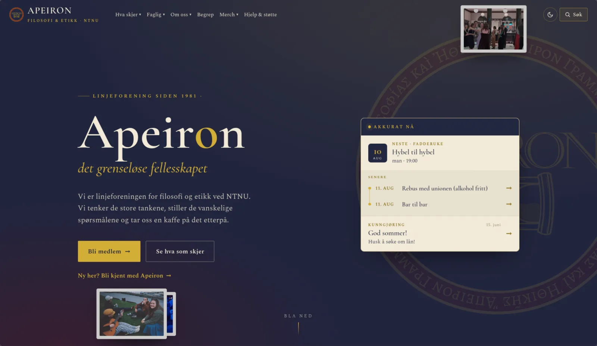

# 🌐 Apeiron: Linjeforeningens nettside

Nettsiden for **Apeiron**, linjeforeningen for filosofi og etikk ved NTNU.
Statisk side (HTML/CSS/JS) på Cloudflare Pages, uten byggesteg og uten avhengigheter å installere.

Siden er bygget opp for å dekke det meste av behov, slik at vi kan fortsette på vår nettverksbygger som vil dekke behovene som ikke er lett tilgjengelig i Admin-senteret.

👉 **Se siden live: [apeironlf.pages.dev](https://apeironlf.pages.dev)**

[](https://apeironlf.pages.dev)
[](https://apeironlf.pages.dev/admin.html)
[](LICENSE)

[](https://apeironlf.pages.dev)

---

## 🧭 Hva vil du gjøre?

- 🖊️ **Endre innhold** (nyheter, styret, merch, tekster, bilder …) →
  **[BRUKERVEILEDNING.md](BRUKERVEILEDNING.md)** — alt gjøres i Admin-senteret i nettleseren, uten kode
- 📅 **Legge inn et arrangement** → Google Kalender, se
  [BRUKERVEILEDNING.md → Arrangementer](BRUKERVEILEDNING.md#arrangementer-og-fadderuke-google-kalender)
- 📷 **Laste opp bilder til galleriet** → Google Drive, se
  [BRUKERVEILEDNING.md → Galleri](BRUKERVEILEDNING.md#galleri-google-drive)
- 🔧 **Drifte koden** (publisering, oppsett, filstruktur) → **[VEDLIKEHOLD.md](VEDLIKEHOLD.md)**

> 🧑‍🔧 **Den ene regelen:** hvis du ikke vedlikeholder selve koden, skal du aldri redigere
> filer på GitHub. All innholdsredigering skjer i
> [Admin-senteret](https://apeironlf.pages.dev/admin.html) — se [BRUKERVEILEDNING.md](BRUKERVEILEDNING.md).

---

## 📚 Dokumentasjon

| Dokument | For hvem | Hva det er |
| --- | --- | --- |
| 📖 **README** (du er her) | Alle | Landingsside: hva dette er + hvor du finner alt |
| 🖊️ **[BRUKERVEILEDNING.md](BRUKERVEILEDNING.md)** | Styret | Brukerveiledning: endre innhold via Admin-senteret, kalender og galleri |
| 🔧 **[VEDLIKEHOLD.md](VEDLIKEHOLD.md)** | Drifter | Teknisk drift: publisering, lokal kjøring, manuell redigering, filstruktur, Apps Script |
| 🗝️ **[docs/eierskap-og-overlevering.template.md](docs/eierskap-og-overlevering.template.md)** | Styret | «Nøkkelknippet»: hvem eier hva + sjekkliste ved styreskifte (mal — den utfylte kopien holdes privat) |
| 🏗️ **[docs/admin-arkitektur.md](docs/admin-arkitektur.md)** | Drifter | Hvordan Admin-senteret er bygd + veikart mot klonbar mal |
| ☁️ **[docs/github-publisering-oppsett.md](docs/github-publisering-oppsett.md)** | Drifter | Engangsoppsett av «Publiser til GitHub» (OAuth + Cloudflare-miljøvariabler) |
| 🛒 **[docs/apps-script-oppsett.md](docs/apps-script-oppsett.md)** | Drifter | Steg-for-steg: merch-bestilling (Google Sheet + Apps Script) |
| ✅ **[TODO.md](TODO.md)** | Begge | To-do-lista og domene-status |
| 📝 **[CHANGELOG.md](CHANGELOG.md)** | Begge | Logg over hva som er gjort |

---

## Slik er nettsiden bygd (kort)

Statisk side (HTML/CSS/JS), ingen byggesteg. Meny og footer bygges sentralt fra
`content/nav-content.js` / `content/site-content.js` via `js/site-chrome.js` og injiseres på alle sider.
Sideinnhold ligger i data-filer (`*-content.js` / `*-config.js`), ikke hardkodet i HTML.

**All redigering skjer i ett samlet Admin-senter (`admin.html`):** et skall som
mounter tynne editor-moduler fra `js/admin/modules/<område>.js`. Modulene deler
`js/admin/admin-common.js` (datalager `createStore`, drag-sortering, hjelpebobler, `saveFile`,
panel-registeret `AdminPanels`) og `css/admin-modules.css` (klasse-scopet stil per modul).
Hver modul har live forhåndsvisning. Redigeringsløkka er
*rediger → **☁ Publiser** → Cloudflare bygger (~1 min)*; en nedlastings-backup
finnes for manuell publisering (se [VEDLIKEHOLD.md](VEDLIKEHOLD.md)).
Full arkitekturforklaring: [docs/admin-arkitektur.md](docs/admin-arkitektur.md).

**To redigeringsvisninger (Innstillinger ⚙ → «Panelvisning»):** alle panelene kan vises som
**Liste + detalj**, et delt `js/admin/admin-panel-shell.js` (PanelShell) med en smal, søkbar
navigator + ett skjema om gangen, eller som **Klassisk (Legacy)**, den opprinnelige
visningen med kort i full bredde. Valget lagres i nettleseren. PanelShell gjenbruker
modulenes egne kort-byggere, så all logikk (bilder, lagring, angre, publisering) er felles
mellom visningene. Skallet velger «rail-type» per panel (samlinger / enkeltliste /
status-filter / seksjoner / liste-i-detalj). Global **Ctrl/Cmd+Z** angrer både slettinger
og tillegg.

---

## Synlighet i søkemotorer og KI

Siden er satt opp for å bli funnet i søkemotorer (Google, Bing) og av KI/LLM-er som
søker på vegne av brukere: `robots.txt`, `sitemap.xml`, kanoniske URL-er, delingskort
(`og:`/`twitter:`) og maskinlesbare strukturerte data (JSON-LD) som beskriver hvem
Apeiron er. Alt er usynlig for besøkende og rører ikke admin. Full forklaring + hva som
må vedlikeholdes (særlig: oppdater `sitemap.xml` ved nye sider, og bytt basis-URL ved
nytt domene) står i **[VEDLIKEHOLD.md → Synlighet i søkemotorer og KI (SEO)](VEDLIKEHOLD.md#synlighet-i-søkemotorer-og-ki-seo)**.

---

## Kjente begrensninger og usikkerheter

Ting vi vet om, men er usikre på om det er verdt å gjøre noe med. Ført opp så de ikke glemmes, ikke nødvendigvis feil som må fikses.

<details>
<summary><b>Vis de fire punktene</b></summary>

- **Merch: én farge kan bare kobles til ett bilde.** Har du to bilder av samme farge (f.eks. for- og bakside av samme genser), kan bare det ene knyttes til fargen. Velger man samme farge på bilde nummer to, flyttes koblingen dit. Lite problem i praksis (kunden ser uansett hele galleriet via miniatyrstripa). Å støtte flere bilder pr. farge ville kreve en mer kompleks datamodell.
- **Meny og footer vises et lite øyeblikk etter at siden lastes.** De bygges av `js/site-chrome.js` i nettleseren (for å slippe byggesteg og holde alt i én fil). På treg forbindelse kan man så vidt se at de «popper inn». Menyen er fast posisjonert, så selve innholdet hopper ikke. Alternativet (byggesteg) ble vurdert og valgt bort, se diskusjon i commit-historikk.
- **Footer/meny krever JavaScript.** Med JS avslått vises ikke meny/footer. Gjelder en svært liten andel besøkende; resten av siden bruker uansett JS (kalender, søk, kurv).
- **Bilder lagres som base64 i datafilene.** Mange/store produktbilder gjør `content/merch-products.js` stor. Admin komprimerer hvert bilde ved opplasting (nedskalering + webp med et størrelsestak per panel — merch maks 900–1000px og ~250 kB; se [VEDLIKEHOLD.md → Bildekomprimering](VEDLIKEHOLD.md#bildekomprimering-skjer-automatisk-ved-opplasting)), men mange bilder kan likevel summere seg. Vurder eksterne bildefiler (`assets/merch/...`) hvis filene blir veldig store (vurdering ligger i [TODO.md](TODO.md)).

</details>

---

## Lisens

[MIT License](LICENSE)

**Vibrasjonskoding har aldri vært så effektivt!**

```
                                  |
                                 |||
                                |||||
                  |    |    |   |||||||
                 )_)  )_)  )_)   ~|~
                )___))___))___)\  |
               )____)____)_____)\\|
             _____|____|____|_____\\\__
             \                       /
       ~^~^~~^~^~~^~^~~^~^~~^~^~~^~^~~^~^~
               ~^~  all aboard!  ~^~
       ~^~^~~^~^~~^~^~~^~^~~^~^~~^~^~~^~^~
```

© 2026 Apeiron Linjeforening
